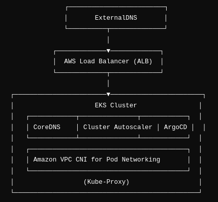

# Add-ons: Enhancing Kubernetes Clusters

## Overview

Add-ons are modular, pre-packaged solutions that extend the functionality of Kubernetes clusters. In Amazon Elastic Kubernetes Service (EKS), add-ons simplify the deployment and management of essential components such as networking, observability, security, and more.

These add-ons are typically managed by the cloud provider or third-party vendors, making them easier to install, update, and maintain compared to manually configuring these components.

## Why Add-ons Are Important

1. **Simplifies Cluster Management**  
   Add-ons reduce the complexity of managing critical services in a Kubernetes cluster by:
    - Providing pre-configured components with optimal settings.
    - Abstracting away low-level details while retaining configurability.

2. **Standardization**  
   By using add-ons, organizations ensure that their clusters adhere to best practices and are consistent across environments. This reduces configuration drift and improves reliability.

3. **Ease of Updates**  
   Managed add-ons can be easily updated with minimal downtime:
    - Updates are tested by providers to ensure compatibility.
    - Automation of version management reduces manual intervention.

4. **Enhanced Security**  
   Add-ons such as CoreDNS and VPC CNI are tested and hardened by AWS or other providers. Managed versions reduce the risk of vulnerabilities compared to custom-configured alternatives.

5. **Focus on Application Development**  
   Instead of spending time configuring essential services, teams can focus on building and deploying applications.

## Problems Solved by Add-ons

#### **Problem 1:** Complex Initial Setup

Manually configuring essential components like networking, DNS, and observability often involves:
- Writing complex YAML or Helm charts.
- Debugging subtle misconfigurations.

Add-ons streamline this process with pre-tested setups.

#### **Problem 2:** Maintenance Overhead

Keeping critical components up to date across multiple clusters can be error-prone and time-consuming. Add-ons provide a centralized way to manage these updates.

#### **Problem 3:** Inconsistencies Across Environments

Without add-ons, configurations can differ across clusters, leading to unpredictable behavior. Managed add-ons enforce consistency and adhere to industry standards.

#### **Problem 4:** Suboptimal Performance

Manually configured components might not leverage cloud-native optimizations. Add-ons like the Amazon VPC CNI are designed to integrate tightly with AWS infrastructure for superior performance.

## Why Use Add-ons Instead of Manual Configuration?

| Aspect                 | Add-ons Approach                                | Manual Configuration                     |
|-----------------------|------------------------------------------------|-----------------------------------------|
| **Ease of Use**       | Pre-packaged; minimal setup required.          | High learning curve; manual setup needed.        |
| **Updates**           | Automated or semi-automated by the provider.   | Manual updates; prone to errors.        |
| **Security**          | Regular patches provided by AWS/third-party.   | Admin must monitor and patch manually.  |
| **Performance**       | Optimized for specific environments (e.g., AWS).| Requires in-depth tuning for optimization.      |
| **Time Efficiency**   | Faster to deploy and manage.                    | Time-consuming setup and maintenance.   |


### Architecture Diagram



### Core Add-ons

#### 1. CoreDNS

- **Purpose**: Provides DNS service discovery for Kubernetes applications within the cluster.
- **Key Features**:
    - Handles internal DNS resolution for Kubernetes services.
    - Ensures that applications can easily find and communicate with each other.
- **Why It’s Important**:
    - Seamless service discovery is crucial for microservices architectures.
    - Managed by AWS to ensure performance and security.

#### 2. Amazon VPC CNI

- **Purpose**: Manages pod networking by assigning AWS VPC IP addresses to pods.
- **Key Features**:
    - Tight integration with AWS networking.
    - Supports high-performance and scalable networking.
- **Why It’s Important**:
    - Enables Kubernetes to leverage AWS-native networking features for improved performance and scalability.

#### 3. Kube-Proxy

- **Purpose**: Maintains network rules on nodes for service communication.
- **Key Features**:
    - Manages iptables or IPVS rules to handle Kubernetes service traffic.
- **Why It’s Important**:
    - Ensures reliable and efficient routing of traffic within the cluster.

### Optional Add-ons

#### 4. AWS Load Balancer Controller

- **Purpose**: Automates the creation and management of AWS Elastic Load Balancers (ALB/NLB) for Kubernetes services.
- **Key Features**:
    - Integrates with Kubernetes Ingress and Service resources.
    - Simplifies exposing applications to the internet or internal users.
- **Why It’s Important**:
    - Eliminates manual configuration of AWS load balancers.
    - Enhances scalability and availability of applications.
- **Custom Configuration**:
    - Sets specific resource requests (CPU and memory) for efficient usage.
    - Disables the `enableServiceMutatorWebhook` for custom service management.

#### 5. ExternalDNS

- **Purpose**: Automatically manages DNS records in Route 53 for Kubernetes services.
- **Key Features**:
    - Integrates with Kubernetes services to create/update DNS records.
    - Ensures that services are accessible using human-readable domain names.
- **Why It’s Important**:
    - Automates DNS management, reducing manual overhead.
    - Integrates seamlessly with AWS Route 53.
- **Custom Configuration**:
    - Uses the external-dns Helm chart for deployment.
    - Pulls configuration from a template file (`externaldns-values.yaml`) for consistent setup.

#### 6. Cluster Autoscaler

- **Purpose**: Automatically adjusts the number of nodes in a cluster based on workload demands.
- **Key Features**:
    - Scales nodes up or down depending on pod resource requirements.
    - Monitors pending pods and adjusts cluster size dynamically.
- **Why It’s Important**:
    - Ensures cost efficiency by running only the resources needed.
    - Improves application reliability by preventing resource bottlenecks.
- **Custom Configuration**:
    - Uses Helm chart with a custom values file (`autoscaler-values.yaml`).
    - Deployed in the `kube-system` namespace for cluster-wide operation.

#### 7. ArgoCD

- **Purpose**: Implements GitOps for Kubernetes, allowing declarative management of applications.
- **Key Features**:
    - Synchronizes Kubernetes resources with Git repositories.
    - Provides a UI and CLI for application lifecycle management.
- **Why It’s Important**:
    - Facilitates continuous deployment and rollbacks with version control.
    - Enhances visibility and control over application deployments.
- **Custom Configuration**:
    - Configured with a template file (`argocd-values.yaml`) for:
        - OIDC integration for authentication.
        - Domain and certificate setup for HTTPS access.

### Deploying Add-ons within our  Terraform Module

The following sample snippet demonstrates how to deploy various Kubernetes add-ons using the `aws-ia/eks-blueprints-addons` module.

```hcl
module "eks_blueprints_addons" {
  source  = "aws-ia/eks-blueprints-addons/aws"
  version = "~> 1.0"
  
  cluster_name       = module.eks.cluster_name
  cluster_endpoint   = module.eks.cluster_endpoint
  oidc_provider_arn  = module.eks.oidc_provider_arn

  eks_addons = {
    coredns = {
      most_recent = true
    }
    vpc-cni = {
      most_recent = true
    }
    kube-proxy = {
      most_recent = true
    }
  }

  enable_aws_load_balancer_controller = true
  aws_load_balancer_controller = {
    set = [
      {
        name  = "vpcId"
        value = module.vpc.vpc_id
      }
    ]
  }

  enable_external_dns = true
  external_dns = {
    name = "external-dns"
  }

  enable_cluster_autoscaler = true
  cluster_autoscaler = {
    name = "cluster-autoscaler"
  }

  enable_argocd = true
  argocd = {
    name = "argocd"
  }
}
```
### Explanation of Key Parameters
- ```source:``` Specifies the source of the module, in this case, pulling from the AWS community module repository for EKS blueprints.
- ```version:``` Sets the version constraint for the module being used, ensuring compatibility and stability.
- ```cluster_name:``` References the name of the EKS cluster created by another module (in this case, module.eks).
- ```cluster_endpoint:``` Connects to the EKS cluster's endpoint for managing services.
- ```oidc_provider_arn:``` Points to the OIDC provider ARN associated with the EKS cluster, essential for managing IAM roles for service accounts.
### Add-ons Configuration
1. **EKS Addons:** ```eks_addons``` Contains a configuration block for deploying specific add-ons like CoreDNS, VPC CNI, and kube-proxy. The most_recent parameter ensures that the latest stable version of these components is used.

2. **AWS Load Balancer Controller:** This section enables and configures the AWS Load Balancer controller, specifying the necessary VPC ID for proper access.

3. **External DNS:** When enabled, it manages DNS records in Route 53 for Kubernetes services, providing a name for the deployment.

4. **Cluster Autoscaler:** This optional feature automatically adjusts the number of nodes based on workload demand and features a name for identification.

5. **ArgoCD:** Deploys the ArgoCD GitOps tool for managing Kubernetes deployments with declarative configurations, also requiring a name.

## Conclusion

Using add-ons in an Amazon EKS environment can significantly enhance manageability, security, and performance. They abstract away many complexities associated with Kubernetes management, allowing teams to focus more on developing and deploying their applications rather than dealing with the underlying infrastructure.
