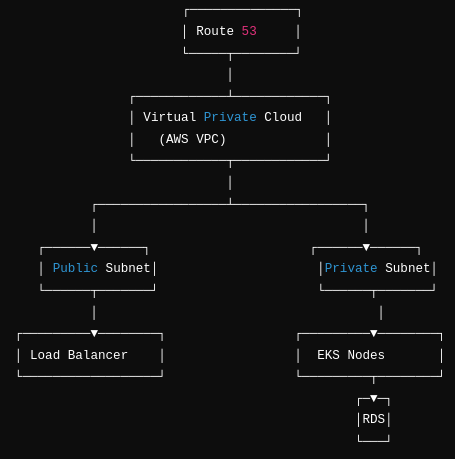

# Complete Terraform Documentation for EKS Cluster with RDS

This documentation provides a step-by-step guide for deploying an Amazon Elastic Kubernetes Service (EKS) cluster and a PostgreSQL RDS database using Terraform as our Infrastructure-as-Code (IaC) tool. This guide is tailored for beginners and professionals alike, ensuring clarity at every stage and showcasing industry best practices.

## Table of Contents
1. [Introduction](#introduction)
2. [Infrastructure Overview](#infrastructure-overview)
3. [Architecture Diagram](#architecture-diagram)
4. [Pre-Requisites](#pre-requisites)
5. [Project Structure](#project-structure)
6. [Step-by-Step Guide](#step-by-step-guide)
7. [Best Practices](#best-practices)
8. [Sample Commands](#sample-commands)
9. [Further Reading and References](#further-reading-and-references)

## Introduction

Terraform allows us to write declarative infrastructure definitions to automate the deployment of resources on cloud platforms like AWS. This guide focuses on deploying an Amazon EKS cluster and an Amazon RDS PostgreSQL database, along with the necessary networking and security configurations.

By the end of this documentation, you will:
- Understand how to set up Terraform for AWS.
- Learn how to define and manage resources like EKS and RDS.
- Gain insights into best practices for Terraform projects.

## Infrastructure Overview

Our Terraform project automates the creation of the following components:

1. **Virtual Private Cloud (VPC)**:
    - Includes public, private, and intra-subnets for resource segmentation.
    - Configures routing, NAT Gateways, and security groups.

2. **Amazon EKS**:
    - Deploys a Kubernetes control plane with managed node groups.
    - Ensures scalability, security, and ease of application deployment.

3. **Amazon RDS PostgreSQL**:
    - A managed database solution for storing application data.
    - Configured for high availability, backups, and encryption.

## Architecture Diagram

Below is a visual representation of the architecture:

 


## Pre-Requisites

### Tools and Dependencies

1. **Terraform**
    - Download and install Terraform: [Download Terraform](https://www.terraform.io/downloads.html)

2. **AWS CLI**
    - Download and configure the AWS CLI: [AWS CLI Installation](https://docs.aws.amazon.com/cli/latest/userguide/install-cliv2.html)

3. **kubectl** (Optional for managing Kubernetes directly):
    - Install: [kubectl Installation](https://kubernetes.io/docs/tasks/tools/install-kubectl/)

### AWS CLI Setup
1. Install CLI using
```bash
curl "https://awscli.amazonaws.com/AWSCLIV2.pkg" -o "AWSCLIV2.pkg"
sudo installer -pkg AWSCLIV2.pkg -target /
```
2. Configure AWS CLI with your credentials:
```bash
aws configure
```
- Enter your Access Key ID and Secret Access Key.
- Specify your preferred region (e.g., us-east-1).

3. Verify Installation using  
```bash
aws sts get-caller-identity
```
## Project Structure

The project is structured as follows:
```plaintext

├──webank-devops
└── terraform/
   ├── main.tf           # Main Terraform file
   ├── variables.tf      # Input variables
   ├── outputs.tf        # Exported outputs
   ├── eks.tf            # EKS configuration
   ├── vpc.tf            # VPC configuration
   ├── rds.tf            # RDS configuration
   └── provider.tf       # Providers and backend setup
```
# Step-by-Step Guide

## 1. VPC Setup

The VPC module defines the networking layer for the infrastructure.
EKS clusters require a VPC. Creating a VPC suitable for an AWS EKS cluster involves setting up various network components including subnets, route tables, and security groups. Below is a Terraform example that demonstrates how to create a basic VPC setup for EKS. This setup includes public subnets,private subnets,intra subnets and database subnets for the EKS cluster, which allows your Kubernetes nodes to communicate with the AWS EKS control plane and other AWS services.

### vpc.tf:

```hcl
module "vpc" {
  source  = "terraform-aws-modules/vpc/aws"
  version = "~> 5.0"

  name = "${local.name}-vpc"
  cidr = var.vpc_cidr
  azs  = var.azs

  default_security_group_name = "${local.name}-sg"

  public_subnets   = [for k, v in local.azs : cidrsubnet(var.vpc_cidr, 8, k)]
  private_subnets  = [for k, v in local.azs : cidrsubnet(var.vpc_cidr, 8, k + 2 * local.azs_count)]
  database_subnets = [for k, v in local.azs : cidrsubnet(var.vpc_cidr, 8, k + 7 * local.azs_count)]
  intra_subnets    = [for k, v in local.azs : cidrsubnet(var.vpc_cidr, 8, k + 13 * local.azs_count)]

  enable_vpn_gateway           = true
  enable_nat_gateway           = true
  single_nat_gateway           = true
  one_nat_gateway_per_az       = false
  create_database_subnet_group = true
  enable_dns_hostnames         = true
  enable_dns_support           = true

  public_subnet_tags = {
    "kubernetes.io/role/elb" = 1
  }

  private_subnet_tags = {
    "kubernetes.io/role/internal-elb" = 1
  }

  tags = merge(
    local.tags,
    {
      "kubernetes.io/cluster/${local.name}-eks" = "shared"
    }
  )
}
```
### Detailed Explanation

1. **Module Source:**
source = ```"terraform-aws-modules/eks/aws": ```This line specifies that we're using the official AWS EKS module from the Terraform Registry.
2. **Cluster Configuration:**
```cluster_name = "eks-cluster":``` Sets the name of the EKS cluster.
```cluster_version = "1.24":``` Specifies the Kubernetes version to use (1.24 in this case).
3. **Networking:**
```subnets = module.vpc.private_subnets:``` The EKS cluster will be deployed in the private subnets of the VPC we created earlier.
```vpc_id = module.vpc.vpc_id:``` Associates the EKS cluster with our VPC.
4. **Node Groups:**
The node_groups block defines the configuration for the EKS managed node groups.
- eks_nodes: This is the name of our node group.
- desired_capacity = 3: The cluster will try to maintain 3 nodes.
- max_capacity = 5: The cluster can scale up to a maximum of 5 nodes.
- min_capacity = 1: The cluster will always have at least 1 node running.
- instance_types = ["t3.medium"]: Specifies the EC2 instance type for the nodes.

5. **Tagging:**
```tags = { Environment = "dev" }:``` Adds a tag to the EKS cluster resources for easier management and cost allocation.

## 2. EKS Cluster Setup

The EKS module provisions the Kubernetes control plane, worker nodes, and associated IAM roles.


### eks.tf:

```hcl
module "eks" {
  source  = "terraform-aws-modules/eks/aws"
  version = "~> 20.0"

  cluster_name                   = "${local.name}-eks"
  cluster_endpoint_public_access = true
  enable_efa_support             = true
  vpc_id                         = module.vpc.vpc_id
  subnet_ids                     = module.vpc.private_subnets
  control_plane_subnet_ids       = module.vpc.intra_subnets
  create_cloudwatch_log_group    = false

  eks_managed_node_groups = {
    webank-cluster-wg = {
      name           = local.name
      min_size       = var.eks_min_instance
      max_size       = var.eks_max_instance
      desired_size   = var.eks_desired_instance
      instance_types = var.eks_ec2_instance_types
      capacity_type  = "SPOT"
    }
  }
}

```
### Detailed Explanation
1. **Module Source:**
- ```source = "terraform-aws-modules/eks/aws": ```Utilizes the official AWS EKS module from the Terraform Registry.
```version = "~> 20.0":``` Specifies the module version to ensure compatibility and access to the latest features.

2. **Cluster Configuration:**
- ```cluster_name = "${local.name}-eks":``` Sets the name of the EKS cluster using a local variable for dynamic naming.
- ```cluster_endpoint_public_access = true:``` Enables public access to the Kubernetes API server endpoint, allowing access from outside the VPC.
3. **Enhanced Networking:**
- ```enable_efa_support = true:``` Enables Elastic Fabric Adapter (EFA) support for high-performance computing workloads, if applicable.
4. **Networking:**
- ```vpc_id = module.vpc.vpc_id:``` Associates the EKS cluster with the VPC created earlier.
- ```subnet_ids = module.vpc.private_subnets:``` Deploys worker nodes in private subnets for enhanced security.
- ```control_plane_subnet_ids = module.vpc.intra_subnets:``` Specifies subnets for EKS control plane traffic, typically intra-subnets for isolation.
5. **Logging:**
- ```create_cloudwatch_log_group = false:``` Disables automatic creation of a CloudWatch log group. You can manage logging separately if needed.
6. **Node Groups:**
The eks_managed_node_groups block defines managed node groups.
- ```webank-cluster-wg:``` Name of the node group.
- ```name = local.name:``` Uses a local variable for dynamic naming of node groups.
- ```min_size, max_size, desired_size:``` Configurable parameters for scaling node groups based on variables (var.eks_min_instance, etc.).
- ```instance_types = var.eks_ec2_instance_types:``` Allows flexibility in choosing EC2 instance types via variables.
- ```capacity_type = "SPOT":``` Utilizes Spot Instances for cost savings, suitable for fault-tolerant workloads.
        
## 3. RDS Database Setup

This section details the configuration of an Amazon RDS (Relational Database Service) instance using Terraform.

### rds.tf:

```hcl
module "db" {
  source  = "terraform-aws-modules/rds/aws"
  version = "~> 5.0"

  identifier = "mydb"

  engine            = "postgres"
  engine_version    = "17"
  instance_class    = "db.t3.micro"
  allocated_storage = 20

  db_name  = "mydb"
  username = var.db_username
  password = var.db_password
  publicly_accessible = false

  family = "postgres17"

  vpc_security_group_ids = [module.security_group.security_group_id]
  db_subnet_group_name   = module.vpc.database_subnet_group
  storage_encrypted      = true
  backup_retention_period = var.db_backup_retention_period

  skip_final_snapshot = var.db_skip_final_snapshot
  deletion_protection = !var.db_skip_final_snapshot

  create_db_subnet_group = false
  create_random_password = false

  create_cloudwatch_log_group = false

  tags = merge(
    local.tags,
    {}
  )
}
```
### Explanation of Key Configuration Options
1. **Database Engine:**
- ```engine = "postgres":``` Specifies PostgreSQL as the database engine.
- ```engine_version = "17":``` Uses PostgreSQL version 17.
- ```family = "postgres17":``` Specifies the database parameter group family.
2. **Instance Configuration:**
- ```instance_class = "db.t3.micro":``` Sets the RDS instance type.
- ```allocated_storage = 20:``` Allocates 20GB of storage for the database.
3. **Access and Security:**
- ```publicly_accessible = false:``` Ensures the database is not accessible from the public internet.
- ```vpc_security_group_ids:``` Associates the database with a specific security group.
- ```db_subnet_group_name:``` Places the RDS instance in specific subnets within the VPC.
- ```storage_encrypted = true:``` Enables encryption at rest for the database.
4. **Backup and Recovery:**
- ```backup_retention_period = var.db_backup_retention_period:``` Sets the number of days to retain backups.
- ```skip_final_snapshot = var.db_skip_final_snapshot:``` Determines whether to skip the final snapshot when the database is destroyed.
- ```deletion_protection = !var.db_skip_final_snapshot:``` Enables deletion protection if final snapshots are not skipped.
5. **Customization and Management:**
- ```create_db_subnet_group = false:``` Assumes the subnet group is managed elsewhere.
- ```create_random_password = false:``` Uses the provided password instead of generating a random one.
- ```create_cloudwatch_log_group = false:``` Disables automatic creation of CloudWatch log groups.

6. **Tagging:**
tags = merge(local.tags, {}): Applies a set of tags to the RDS instance, merging with locally defined tags.

## Deployment Instructions
Initialize Terraform:

```bash
 terraform init
```
Validate Configuration:
```bash
terraform validate
```
Plan Infrastructure:
```bash
terraform plan -var="db_username=<your-username>" -var="db_password=<your-password>"
```
Apply Changes:
```bash
terraform apply -var="db_username=<your-username>" -var="db_password=<your-password>"
```
## Some Best Practices
1. Modular Design:
- Keep resources logically grouped to simplify maintenance.
- Reuse modules for consistent infrastructure setup.
2. Security:
- Use private subnets for sensitive resources like RDS and worker nodes.
- Enable encryption for all data at rest (e.g., RDS storage).
- Restrict access to resources using security groups and IAM policies.
3. Scalability:
- Configure Cluster Autoscaler for dynamic scaling of worker nodes.
- Use managed services (e.g., EKS, RDS) for easier scaling and upgrades.
4. Cost Optimization:
- Leverage spot instances for EKS worker nodes.
- Set appropriate retention policies for backups and logs.
- Configuration Management:
- Use Terraform state locking to prevent concurrent modifications.
- Store Terraform state securely in an S3 bucket with versioning.

# Conclusion


