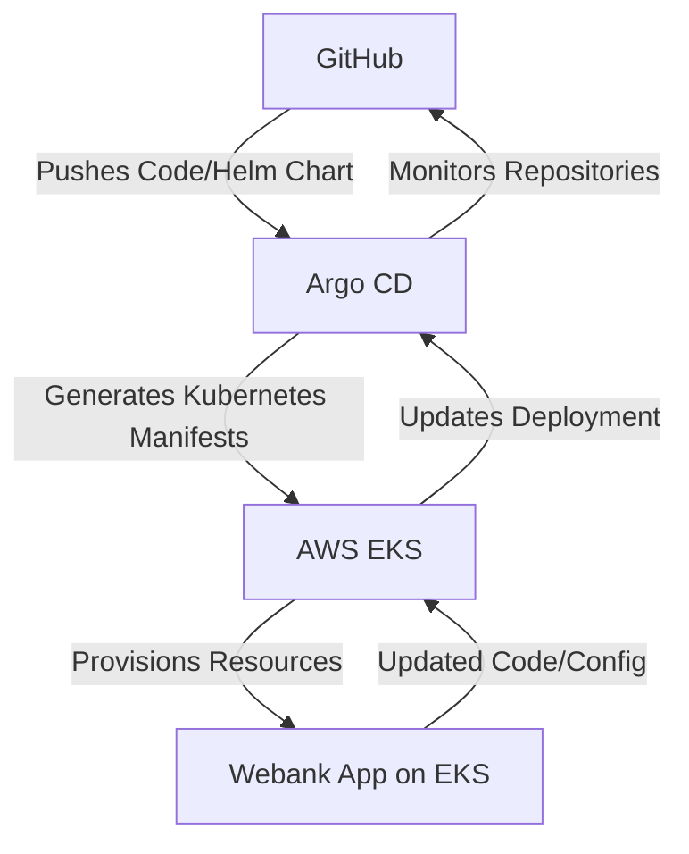

# webank DevOps

## Table of Contents

1. [Introduction](#introduction)
2. [Repository Structure](#repository-structure)
3. [Key Components](#key-components)
4. [Communication Flow](#communication-flow)
5. [Security Considerations](#security-considerations)
6. [License](#license)
7. [Further Resources](#further-resources)

---

## Introduction

webank-devops serves as the central hub for managing the deployment, infrastructure, and configuration of the webank system. It contains Terraform code, Helm charts, and other deployment-related resources necessary for provisioning and maintaining environments.

The **webank-devops** repository is structured to support the deployment of Webank applications using Kubernetes. Key features include:

- **Multi-Repository Architecture**: Separate repositories for application code and deployment configurations.
- **GitOps Workflow**: Argo CD manages Kubernetes resources based on GitHub updates.
- **Scalability**: AWS EKS powers the orchestration of microservices and ensures high availability.

---

## Repository Structure

```plaintext
.
├── charts              # Helm charts for microservices
│   ├── webank          # Main Start
│   ├── webank-obs      # Online BAnking application
│   ├── webank-prs      # Pending Registration Service
│   └── webank-userapp  # User facing application
├── deploy              # Deployment configuration directory for the Webank
├── docs                # Deployment guide and supporting documentation
└── terraform           # Infrasrtucture as code
```

### Visit

- [**webank**](https://github.com/ADORSYS-GIS/webank)
- [**webank-obs**](https://github.com/ADORSYS-GIS/webank-OnlineBanking)
- [**webank-prs**](https://github.com/ADORSYS-GIS/webank-pending-registration-service)
- [**webank-userapp**](https://github.com/ADORSYS-GIS/webank-UserApp)

## Key Components

1. **Argo CD:** A continuous delivery tool that automates application deployment to Kubernetes clusters.

   - Refer to [**argocd**](https://github.com/ADORSYS-GIS/webank-devops/blob/main/Docs/argocd-deployment-guide.md) to get more insights on how we provision our application using Argo CD.

2. **AWS EKS:** A managed Kubernetes service offered by Amazon Web Services for deploying and scaling containerized applications.

   - Refer to [**AWS EKS setup**](https://github.com/ADORSYS-GIS/webank-devops/blob/main/Docs/terraform.md) to understand how we provision our AWS EKS and various resources.

3. **GitHub:** A version control system used to host the Webank application code and Helm chart repositories.

## Communication Flow

- **Developer Pushes Code:** A developer commits changes to the Webank repository

- **Argo CD Watches for Changes:** Argo CD continuously monitors the GitHub repositories for updates to the Webank application code or Helm charts.

- **Argo CD Detects Changes:** Upon detecting a change, Argo CD retrieves the updated application code or Helm charts from GitHub.

- **Argo CD Generates Manifests:** Argo CD processes the retrieved Helm charts and generates Kubernetes manifests that define the desired state of the Webank application on the EKS cluster.

- **Argo CD Applies Manifests:** Argo CD applies the generated Kubernetes manifests to the EKS cluster, triggering the deployment process for the updated Webank application.

- **EKS Provisions Resources:** The EKS cluster provisions resources based on the applied manifests, such as deploying containers, creating services, and allocating storage.

- **Webank Application Updates:** The Webank application on the EKS cluster is updated with the latest code or configuration changes.



### Benefits of this Communication Flow

- Automation: The deployment process is automated, reducing manual intervention and the risk of errors.

- Version Control: Integration with Git version control enables easy tracking of changes and rollbacks if necessary.

- Scalability: EKS facilitates scaling the Webank application to accommodate millions of users.

- Open Source: The open-source nature of Argo CD and Helm charts promotes transparency and community collaboration.

### Security Considerations

Since Webank is a banking application handling sensitive user data, security is paramount. Here are some crucial security considerations:

- AWS Security Best Practices: Adhere to AWS security best practices for EKS cluster configuration, including IAM roles, pod security policies, and network isolation.

- Regular Security Audits: Conduct regular security audits of the deployment process and infrastructure to identify and address potential vulnerabilities.

#### License

webank is released under the **Apache 2.0 License**. Please see the [LICENSE](https://github.com/ADORSYS-GIS/webank-devops/blob/main/LICENSE) file for more information.

#### Further Resources

- Argo CD Documentation: <https://argo-cd.readthedocs.io/en/stable/>
- AWS EKS Documentation: <https://docs.aws.amazon.com/eks/>
- Helm Charts Documentation: <https://helm.sh/docs/>
