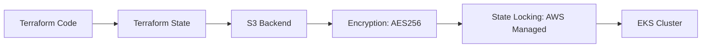
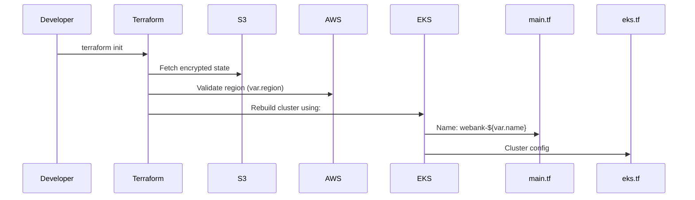
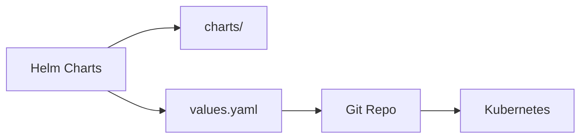
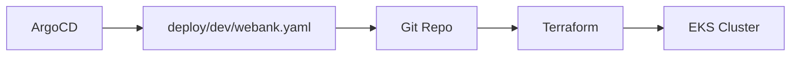
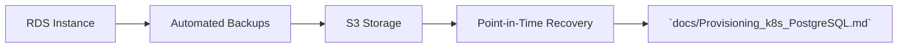
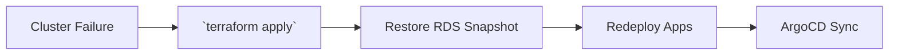
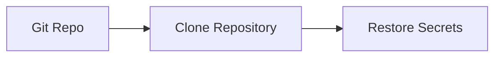
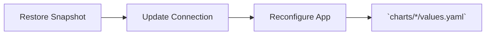
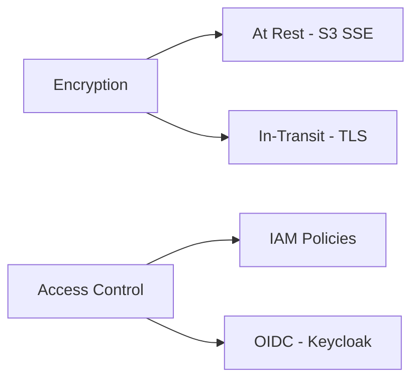
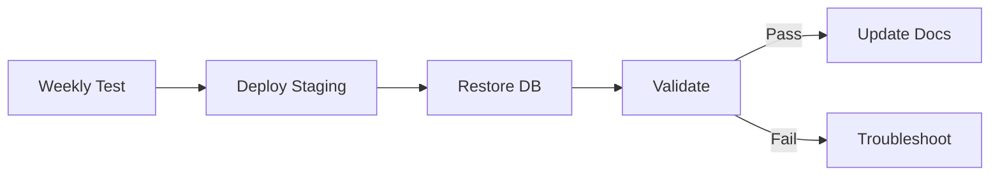

# Webank Disaster Recovery & Backup Strategy

## Key Components We Protect


### 1. Infrastructure (EKS Cluster)


**How we protect it:**
- **Terraform Code**: Complete infrastructure definition in `terraform/` directory
  - `main.tf`: Core architecture (contains naming logic and tagging policy)
  - `eks.tf`: EKS cluster configuration
  - `s3.tf`: [State storage](https://github.com/ADORSYS-GIS/webank-devops/blob/main/terraform/s3.tf) (see encryption config below)

```hcl
# terraform/s3.tf
terraform {
  backend "s3" {
    key            = "terraform.tfstate"
    encrypt        = true  # AES256 encryption at rest
  }
}
```

```hcl
# terraform/main.tf
locals {
  name     = "webank-${var.name}"  # Base name for all resources
  tags = {
    Owner       = local.name,
    Environment = var.environment
  }
}
```

- **State Management**:
  - Versioned S3 storage (configured in S3 bucket properties)
  - AWS-managed state locking (implicit in S3 backend)
  - Secure credentials via AWS provider (see `provider.tf`)

```hcl
# terraform/provider.tf
provider "aws" {
  region = var.region  # Defined in `variables.tf`
}
```

**Recovery Process Flow:**


**Recovery Steps:**
1. Initialize environment:
   ```bash
   cd terraform/
   terraform init  # Uses s3.tf backend config
   ```
2. Apply infrastructure:
   ```bash
   terraform apply  # Uses eks.tf + variables.tf
   ```

**Key Security Features:**
1. Encryption: `encrypt = true` in S3 backend (s3.tf)
2. IAM Role: Kubernetes provider inherits EKS permissions (provider.tf)
3. Resource Naming: All resources prefixed with `webank-${var.name}` (main.tf)

**Critical File References:**
1. [s3.tf](https://github.com/ADORSYS-GIS/webank-devops/blob/main/terraform/s3.tf) - State encryption
2. [main.tf](https://github.com/ADORSYS-GIS/webank-devops/blob/main/terraform/main.tf) - Resource naming/tagging
3. [eks.tf](https://github.com/ADORSYS-GIS/webank-devops/blob/main/terraform/eks.tf) - Cluster definition
4. [provider.tf](https://github.com/ADORSYS-GIS/webank-devops/blob/main/terraform/provider.tf) - AWS region config


### 2. Application Configuration


**How we protect it:**
- All Helm charts in `charts/` directory (webank, webank-obs, etc.)
- Version-controlled in Git with full history
- Values files (like `values.yaml` and `values-postgres.yaml`) store environment-specific settings

**Recovery steps:**
1. Clone git repository
2. Deploy with `helm install` using saved values files

### 3. Continuous Delivery (ArgoCD)


**How we protect it:**
- ArgoCD configuration stored in git (see `docs/argocd-deployment-guide.md`)
- Application manifests in `deploy/dev/webank.yaml`
- Kubernetes secrets for credentials stored in git (encrypted)

**Recovery steps:**
1. Reinstall ArgoCD using terraform
2. Apply saved manifests: `kubectl apply -f deploy/dev/webank.yaml`

### 4. Database (PostgreSQL)


**How we protect it:**
- AWS RDS automated daily backups (configured in `terraform/rds.tf`)
- Point-in-time recovery enabled (retention period defined in terraform)
- Manual snapshots stored in S3

**Recovery steps:**
1. Use AWS Console or CLI to restore RDS snapshot
2. Follow `docs/Provisioning_k8s_PostgreSQL.md` for reconfiguration

## Recovery Scenarios

### Scenario 1: Complete Infrastructure Loss


**Steps:**
1. Recreate EKS cluster: `terraform apply` in `terraform/`
2. Redeploy ArgoCD: Follow `docs/argocd-deployment-guide.md`
3. Restore database from RDS snapshot
4. Sync applications through ArgoCD UI

### Scenario 2: Application Configuration Loss


**Steps:**
1. Clone git repository
2. Redeploy Helm charts: `helm install charts/webank`
3. Restore secrets: `kubectl apply -f secrets.yaml`

### Scenario 3: Database Failure


**Steps:**
1. Restore RDS snapshot via AWS Console
2. Update database connection details in:
   - `charts/*/values.yaml`
   - `deploy/dev/webank.yaml`

## Security Considerations


All sensitive data is protected through:
- Encryption at rest (S3 Server Side Encryption)
- In-transit encryption (TLS 1.2+)
- IAM policies for infrastructure access
- OIDC authentication via Keycloak (configured in `terraform/files/argocd-values.yaml`)

## Tools We Actually Use

| Purpose                  | Tool Used               | Configuration Location        |
|--------------------------|-------------------------|-------------------------------|
| Infrastructure Backup    | Terraform + S3          | `terraform/`                  |
| App Configuration Backup | Git + Helm Charts       | `charts/` and `deploy/`       |
| CI/CD System Backup      | ArgoCD + Git            | `docs/argocd-deployment-guide.md` |
| Database Backup          | AWS RDS Automated       | `terraform/rds.tf`            |

## Verification Process


1. **Weekly Tests:** Recreate environment from backups in staging
2. **Monthly Drills:** Practice full recovery using `docs/backup-and-recovery-concept.md`
3. **Automated Checks:** CloudWatch alarms monitor backup success


## Key Metrics: RTO and RPO

## 1. RTO (Recovery Time Objective)

**Definition:**  
The maximum acceptable amount of time that webank can be down after a failure or disaster.

**Objective:**  
≤ 2 hours for core banking services

### What It Means:
RTO defines how quickly webank  must be restored to avoid significant business impact.

### Real Example:
> If webank goes down, and our RTO is **2 hours**, we **must bring it back online within 2 hours** to prevent unacceptable consequences such as customer dissatisfaction, regulatory issues, or financial loss.

To meet this objective, we must make use of the  recovery  processes listed above (e.g., Terraform for infrastructure provisioning, ArgoCD for deployment, and backup/restore mechanisms) are optimized and tested to recover within the defined timeframe.


## 2. RPO (Recovery Point Objective)

**Definition:**  
The maximum acceptable amount of data loss measured in time. It determines how recent webank last backup must be.

**Objective:**  
≤ 15 minutes for transaction data

### What It Means:
RPO indicates how much data webank can afford to lose if a failure occurs.

### Real Example:
> If webank RPO is **15 minutes**, we must perform backups at least every 15 minutes. In case of a database crash, restoring from the last backup ensures we only lose up to 15 minutes of data.

This requires setting up automated, frequent backups (e.g., snapshots, transaction logs) to protect critical data like customer transactions.


These metrics guide our **Disaster Recovery (DR)** and **Business Continuity Planning (BCP)** strategies to ensure resilience and minimize downtime and data loss.