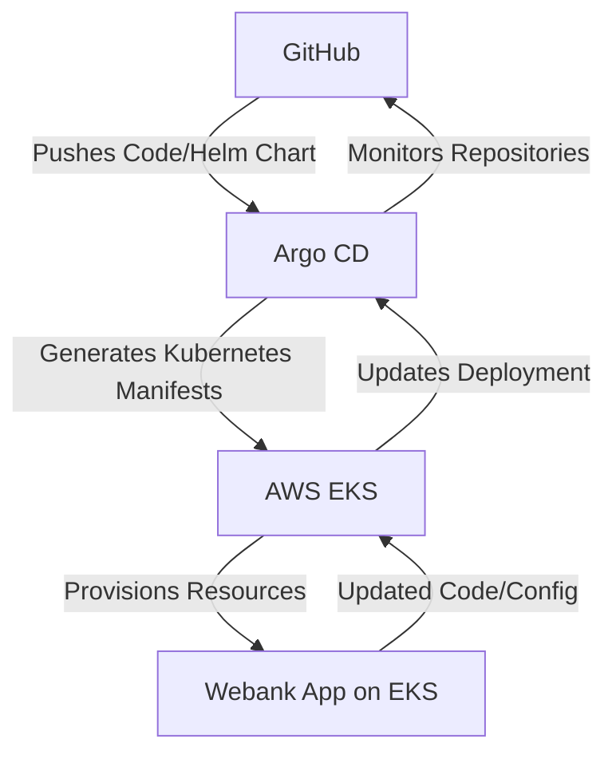

# Communication Between Argo CD, AWS EKS, and GitHub In Webank

This document outlines the communication and deployment process for **Webank**, a scalable, open-source banking application serving millions of users. Leveraging a **multi-repository architecture**, the deployment process integrates **Argo CD**, **AWS EKS**, and **GitHub**, ensuring automation, scalability, and security.

---


## Table of Contents

1. [Overview](#overview)
2. [Repository Structure](#repository-structure)
3. [Key Components](#key-components)
4. [Communication Flow](#communication-flow)
    - [GitHub](#github)
    - [Argo CD](#argocd)
    - [AWS EKS](#aws-eks)
5. [Security Considerations](#security-considerations)
6. [Conclusion](#conclusion)
7. [Further Resources](#further-resources)

---

## Overview

The **webank-devops** repository is structured to support the deployment of Webank applications using Kubernetes. Key features include:

- **Multi-Repository Architecture**: Separate repositories for application code and deployment configurations.
- **GitOps Workflow**: Argo CD manages Kubernetes resources based on GitHub updates.
- **Scalability**: AWS EKS powers the orchestration of microservices and ensures high availability.

---

## Repository Structure

```plaintext
.
├── charts                    # Helm charts for microservices
│   ├── webank                # Main start
│   ├── webank-obs            # Online banking application (center application)
│   └── webank-userapp        # User-facing application
├── Docs                      # Deployment guides and supporting documentation
├── terraform                 # Infrastructure as Code (IaC) for AWS resources
└── LICENSE                   # Licensing information
```
#### visit: 
- <ins> ***[webank](https://github.com/ADORSYS-GIS/webank)***</ins>

- <ins> ***[webank-obs](https://github.com/ADORSYS-GIS/webank-OnlineBanking)***</ins>

- <ins> ***[webank-userapp](https://github.com/ADORSYS-GIS/webank-UserApp)***</ins>

## Key Components

1. **Argo CD:** A continuous delivery tool that automates application deployment to Kubernetes clusters.
- refer to <ins> ***[argocd](https://github.com/ADORSYS-GIS/webank-devops/blob/main/Docs/argocd-deployment-guide.md)***</ins> to get more insights about how  we provision our application argocd

2. **AWS EKS:** A managed Kubernetes service offered by Amazon Web Services for deploying and scaling containerized applications.
- refer to <ins> ***[AWS EKS setup](https://github.com/ADORSYS-GIS/webank-devops/blob/main/Docs/terraform.md)***<ins> to understand how we provision our AWS EKS and various resources

3. **GitHub:** A version control system used to host the Webank application code and Helm chart repositories.

## Communication Flow


- **Developer Pushes Code:** A developer commits changes to the Webank repository

- **Argo CD Watches for Changes:** Argo CD continuously monitors the GitHub repositories for updates to the Webank application code or Helm charts.

- **Argo CD Detects Changes:** Upon detecting a change, Argo CD retrieves the updated application code or Helm charts from GitHub.

- **Argo CD Generates Manifests:** Argo CD processes the retrieved Helm charts and generates Kubernetes manifests that define the desired state of the Webank application on the EKS cluster.

- **Argo CD Applies Manifests:** Argo CD applies the generated Kubernetes manifests to the EKS cluster, triggering the deployment process for the updated Webank application.

- **EKS Provisions Resources:** The EKS cluster provisions resources based on the applied manifests, such as deploying containers, creating services, and allocating storage.

- **Webank Application Updates:** The Webank application on the EKS cluster is updated with the latest code or configuration changes.




### Benefits of this Communication Flow

- Automation: The deployment process is automated, reducing manual intervention and the risk of errors.

- Version Control: Integration with Git version control enables easy tracking of changes and rollbacks if necessary.

- Scalability: EKS facilitates scaling the Webank application to accommodate millions of users.

- Open Source: The open-source nature of Argo CD and Helm charts promotes transparency and community collaboration.


### Security Considerations

Since Webank is a banking application handling sensitive user data, security is paramount. Here are some crucial security considerations:


- AWS Security Best Practices: Adhere to AWS security best practices for EKS cluster configuration, including IAM roles, pod security policies, and network isolation.

- Regular Security Audits: Conduct regular security audits of the deployment process and infrastructure to identify and address potential vulnerabilities.

#### Conclusion

This document has described the communication flow between Argo CD, AWS EKS, and GitHub during the deployment of the Webank application. This integration enables a streamlined, automated, and secure deployment process for a scalable and open-source banking application. Remember to adhere to security best practices to safeguard sensitive user data.

#### Further Resources

- Argo CD Documentation: https://argo-cd.readthedocs.io/en/stable/
- AWS EKS Documentation: https://docs.aws.amazon.com/eks/
- Helm Charts Documentation: https://helm.sh/docs/


